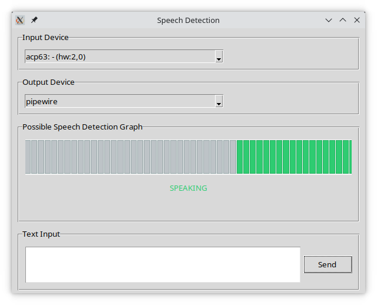

# MiraConverse

MiraConverse: Your AI-Powered Voice Interaction Assistant

MiraConverse is a real-time voice interaction system that serves as your AI conversation partner. By integrating speech recognition and text-to-speech technologies, it delivers a responsive and immersive conversational experience.



*MiraConverse's graphical interface with Mic input, and output device (speakers) selection, speech detection graph and text injection prompt.*

[](https://www.youtube.com/watch?v=n9oD7IPIWVI)

*Click the image above to watch a demo of MiraConverse in action*

## Key Features

- **Model Flexibility:** Supports any model with an OpenAI-compatible API, including local private models, giving you the freedom to choose the best fit for your needs.

- **Customizable Trigger Word:** Easily set your preferred activation word, with "Mira" as the default, ensuring intuitive and natural interactions.

- **Contextual Awareness:** Configurable settings maintain conversation context, enabling fluid and coherent dialogue without repetition.

## Features

- Real-time speech recognition using Whisper
- Natural language processing with LLM integration
- Text-to-speech synthesis using Kokoro
- Graphical interface for audio monitoring and device selection
- Configurable voice trigger system
- Robust WebSocket-based client-server architecture

## System Requirements

### Server Requirements
- Python 3.8 or higher
- NVIDIA GPU with at least 4GB VRAM (required for running both Whisper and Kokoro models)
  - GPU acceleration is required for real-time performance
- Sufficient disk space for models (approximately 10GB total)
- PortAudio library for audio processing
  - Ubuntu/Debian: `sudo apt-get install libportaudio2 portaudio19-dev`
  - Fedora: `sudo dnf install portaudio portaudio-devel`
  - Arch Linux: `sudo pacman -S portaudio`
  - macOS: `brew install portaudio`
  - Windows: Download and install the [PortAudio binaries](http://www.portaudio.com/download.html)
- espeak-ng (optional) for better text-to-speech phonemization
  - Ubuntu/Debian: Usually pre-installed, if not: `sudo apt-get install espeak-ng`
  - Fedora: `sudo dnf install espeak-ng`
  - Arch Linux: `sudo pacman -S espeak-ng`
  - macOS: `brew install espeak-ng`
  - Windows: Download and install from [GitHub releases](https://github.com/espeak-ng/espeak-ng/releases)

### Client Requirements
- Python 3.8 or higher
- Audio input device (microphone)
- Audio output device (speakers)
- Basic CPU for audio processing

## Installation

### Server Setup

The server component requires Python 3.8 or higher and an NVIDIA GPU with at least 4GB VRAM for real-time performance. Choose your operating system below for specific setup instructions.

#### Linux Server Setup

1. Install system dependencies:
```bash
# Ubuntu/Debian
sudo apt-get install python3-venv libportaudio2 portaudio19-dev
# Optional: Install espeak-ng for better text-to-speech phonemization
sudo apt-get install espeak-ng

# Fedora
sudo dnf install python3-venv portaudio portaudio-devel
# Optional: Install espeak-ng for better text-to-speech phonemization
sudo dnf install espeak-ng

# Arch Linux
sudo pacman -S python portaudio
# Optional: Install espeak-ng for better text-to-speech phonemization
sudo pacman -S espeak-ng
```

2. Clone the repository:
```bash
git clone https://github.com/KartDriver/mira_converse.git
cd mira_converse
```

3. Create and activate a virtual environment (recommended):
```bash
python3 -m venv venv
source venv/bin/activate
```

4. Install server dependencies:
```bash
pip install -r server_requirements.txt
```

5. Create your configuration file:
```bash
cp default_config.json config.json
```

6. Set up the required models:
   - Download the Whisper speech-to-text model from [HuggingFace](https://huggingface.co/openai/whisper-large-v3-turbo)
   - Download the Kokoro text-to-speech model from [HuggingFace](https://huggingface.co/hexgrad/Kokoro-82M)
   - Set the downloaded model paths in your config.json

7. Run the server:
```bash
python server.py
```

#### Windows Server Setup

1. Install system dependencies:
   - Install Python 3.8 or higher from [python.org](https://www.python.org/downloads/)
   - Optional: Install espeak-ng from [GitHub releases](https://github.com/espeak-ng/espeak-ng/releases) for better text-to-speech phonemization

2. Install PyTorch with CUDA support:
```bash
pip install torch torchvision --index-url https://download.pytorch.org/whl/cu118
```

3. Clone the repository:
```bash
git clone https://github.com/KartDriver/mira_converse.git
cd mira_converse
```

4. Create and activate a virtual environment (recommended):
```bash
python -m venv venv
venv\Scripts\activate
```

5. Install server dependencies:
```bash
pip install -r windows_server_requirements.txt
```

6. Create your configuration file:
```bash
copy default_config.json config.json
```

7. Set up the required models:
   - Download the Whisper speech-to-text model from [HuggingFace](https://huggingface.co/openai/whisper-large-v3-turbo)
   - Download the Kokoro text-to-speech model from [HuggingFace](https://huggingface.co/hexgrad/Kokoro-82M)
   - Set the downloaded model paths in your config.json

8. Run the server:
```bash
python server.py
```

#### macOS Server Setup

1. Install system dependencies:
```bash
# Install Homebrew if you haven't already
/bin/bash -c "$(curl -fsSL https://raw.githubusercontent.com/Homebrew/install/HEAD/install.sh)"

# Install required packages
brew install python-tk portaudio
# Optional: Install espeak-ng for better text-to-speech phonemization
brew install espeak-ng
```

2. Clone the repository:
```bash
git clone https://github.com/KartDriver/mira_converse.git
cd mira_converse
```

3. Create and activate a virtual environment (recommended):
```bash
python3 -m venv venv
source venv/bin/activate
```

4. Install server dependencies:
```bash
pip install -r server_requirements.txt
```

5. Create your configuration file:
```bash
cp default_config.json config.json
```

6. Set up the required models:
   - Download the Whisper speech-to-text model from [HuggingFace](https://huggingface.co/openai/whisper-large-v3-turbo)
   - Download the Kokoro text-to-speech model from [HuggingFace](https://huggingface.co/hexgrad/Kokoro-82M)
   - Set the downloaded model paths in your config.json

7. Run the server:
```bash
python server.py
```

### Client Setup

#### Linux Setup

1. Install system dependencies:
```bash
# Ubuntu/Debian
sudo apt-get install python3-venv python3-tk libportaudio2 portaudio19-dev
```

2. Create your configuration file:
```bash
cp default_config.json config.json
```

3. (Optional) Create and activate a virtual environment:
```bash
python3 -m venv venv
source venv/bin/activate
```

4. Install dependencies:
```bash
pip install -r client_requirements.txt
```

5. Run the client:
```bash
python client.py
```

#### Windows Setup

1. Install system dependencies:
   - Install Python 3.8 or higher from [python.org](https://www.python.org/downloads/)
   - Download and install [PortAudio binaries](http://www.portaudio.com/download.html)
   - Ensure the PortAudio DLL is in your system PATH

2. Install required Python packages:
```bash
pip install setuptools>=68.0.0 websockets>=11.0.3 numpy>=1.24.0 sounddevice>=0.4.6 openai>=1.3.0 scipy>=1.11.0 soundfile>=0.12.1 PyAudio>=0.2.13
```

3. Create your configuration file:
```bash
copy default_config.json config.json
```

4. (Optional) Create and activate a virtual environment:
```bash
python -m venv venv
venv\Scripts\activate
```

5. Install dependencies:
```bash
pip install -r client_requirements.txt
```

6. Run the client:
```bash
python client.py
```

#### macOS Setup

1. Install system dependencies:
```bash
# Install Homebrew if you haven't already
/bin/bash -c "$(curl -fsSL https://raw.githubusercontent.com/Homebrew/install/HEAD/install.sh)"

# Install required packages
brew install python-tk portaudio
```

2. Create your configuration file:
```bash
cp default_config.json config.json
```

3. (Optional) Create and activate a virtual environment:
```bash
python3 -m venv venv
source venv/bin/activate
```

4. Install dependencies:
```bash
pip install -r client_requirements.txt
```

5. Run the client:
```bash
python client.py
```

## Configuration

The system uses a configuration file to manage all settings. To get started:

1. Copy the default configuration file to create your local config:
```bash
cp default_config.json config.json
```

2. Edit `config.json` with your specific settings:
   - Set paths to your downloaded models
   - Configure server addresses and ports
   - Set API keys
   - Adjust audio processing parameters if needed

Here's a detailed explanation of each configuration section:

### Assistant Settings
```json
"assistant": {
    "name": "Mira"  // Trigger word to activate the assistant
}
```

### Server Configuration
```json
"server": {
    "websocket": {
        "host": "localhost",     // WebSocket server host
        "port": 8765,            // WebSocket server port
        "api_key": "your_secure_key_here"    // Authentication key for client-server communication
    },
    "gpu_device": "auto",      // GPU device selection (auto, cpu, or cuda:N)
    "models": {
        "whisper": {
            // Linux/macOS path example:
            "path": "/home/user/models/whisper-large-v3-turbo",
            // Windows path examples (use either format):
            // "path": "C:/Users/user/models/whisper-large-v3-turbo"
            // "path": "C:\\Users\\user\\models\\whisper-large-v3-turbo"
        },
        "kokoro": {
            // Linux/macOS path example:
            "path": "/home/user/models/Kokoro-82M",
            // Windows path examples (use either format):
            // "path": "C:/Users/user/models/Kokoro-82M"
            // "path": "C:\\Users\\user\\models\\Kokoro-82M",
            "voice_name": "af"          // Voice pack to use
        }
    }
}
```

### OpenAI API Compatible LLM Configuration
```json
"llm": {
    "model_name": "your_model_name",  // Name of the LLM model to use
    "api_base": "http://localhost:8000/v1",  // API endpoint
    "api_key": "your_api_key_here",  // API key for LLM service
    "conversation": {
        "context_timeout": 180,       // Seconds before conversation context expires
        "max_tokens": 8000,          // Maximum tokens for context window
        "temperature": 0.7,          // Response randomness (0.0-1.0)
        "response_max_tokens": 1024   // Maximum tokens per response
    }
}
```

### Audio Processing Settings
```json
"audio_processing": {
    "chunk_size": 2048,          // Audio processing chunk size
    "desired_rate": 16000,       // Target sample rate in Hz
    "noise_floor": {
        "initial": -50.0,        // Initial noise floor (dB)
        "min": -65.0,           // Minimum allowed noise floor (dB)
        "max": -20.0            // Maximum allowed noise floor (dB)
    }
}
```

### Speech Detection Settings
```json
"speech_detection": {
    "preroll_duration": 0.5,     // Audio capture before speech detection (seconds)
    "min_speech_duration": 0.5,  // Minimum duration to consider as speech (seconds)
    "end_silence_duration": 0.8, // Maximum silence before closing capture (seconds)
    "vad_settings": {
        "threshold": 0.3,        // Silero VAD speech detection threshold (0.0-1.0)
        "consecutive_threshold": 2  // Number of consecutive speech frames needed to trigger speech start
    }
}
```

### Client Settings
```json
"client": {
    "retry": {
        "max_attempts": 3,       // Maximum number of connection retry attempts
        "delay_seconds": 2       // Delay between retry attempts in seconds
    }
}
```

These retry settings are used for both initial server connection and automatic reconnection attempts when the connection is lost. The client will attempt to reconnect up to the specified number of attempts, waiting the specified delay between each attempt.

## Usage

1. Start the server:
```bash
python server.py
```

2. Start the client:
```bash
python client.py
```

3. The system will:
   - Initialize audio devices
   - Calibrate noise floor
   - Connect to the server
   - Open the audio control interface
   - Begin listening for the trigger word

4. Speak the trigger word (default: "Mira") followed by your query
   - Example: "Mira, tell me a joke"
   - The system will process your speech and respond through text-to-speech

## Troubleshooting

- If audio devices aren't detected:
  - Windows: Check Sound settings in Control Panel > Sound > Recording/Playback
  - Linux/macOS: Check your system's audio settings
- For GPU errors:
  - Windows: Verify CUDA installation in Device Manager > Display Adapters
  - All systems: Verify CUDA installation and GPU availability
- Connection issues:
  - Windows: Check Windows Defender Firewall settings
  - All systems: Check firewall settings and network connectivity
- For model loading errors:
  - Windows: Ensure paths use either forward slashes (C:/path) or escaped backslashes (C:\\path)
  - All systems: Verify model paths in config.json are correct
- If you experience audio issues:
  - Windows: Check audio format settings in Sound Control Panel
  - All systems: Try adjusting the VAD mode in speech_detection settings

## License

This project is licensed under the MIT License - see the [LICENSE](LICENSE) file for details.

## Contributing

Contributions are welcome! Please feel free to submit a Pull Request. For major changes, please open an issue first to discuss what you would like to change.

Please make sure to update tests as appropriate.

## Architecture

MiraConverse uses a robust client-server architecture designed for scalability and efficiency:

### Server
- Centralized server that handles intensive processing tasks:
  - Speech recognition using Whisper
  - Text-to-speech synthesis using Kokoro
  - WebSocket server supporting multiple concurrent client connections
  - GPU acceleration for real-time model inference
  - Client session management with unique client IDs
  - Noise floor calibration per client

### Client
- Lightweight client focused on audio handling and user interface:
  - Efficient audio capture and streaming
  - Real-time audio level monitoring
  - WebSocket communication with automatic reconnection
  - Graphical interface for audio monitoring
  - Local audio output management
  - Minimal resource requirements (basic CPU for audio processing)

### Key Benefits
- **Scalable**: Single server can support multiple concurrent clients
- **Resource Efficient**: Heavy processing (ML models) runs on server, clients remain lightweight
- **Flexible Deployment**: Server can be run locally or on a remote machine
- **Robust Communication**: WebSocket-based protocol with authentication and automatic reconnection
- **Independent Operation**: Each client maintains its own session state and audio calibration

## Long Term Project Goals

Expand capabailties to become a fully fledged smart home AI assistant with tool calling support and integration with 
third party API's.

1. **Weather Services**
   - Integration with weather APIs for real-time weather information
   - Support for multiple weather data providers

2. **Smart Home Integration**
   - Smart lighting control through various provider APIs
   - Support for major platforms like Philips Hue, LIFX, and other smart lighting systems
   - Expandable framework for other smart home devices
   - Scene creation and management capabilities

3. **Music Service Integration**
   - Spotify API integration for music playback and control
   - Playlist management and music recommendations
   - Support for other music streaming services
   - Voice-controlled music playback features

4. **Advanced Voice Detection and Fingerprinting**
   - Voice fingerprinting for user identification
   - Personalized conversation handling without trigger words
   - Multi-user support with unique voice profiles
   - Dynamic context switching based on speaker identity
   - Continuous conversation mode for fingerprinted voices

5. **Timer and Alarm System**
   - Voice-controlled alarm timer creation and management
   - Multiple concurrent timer support
